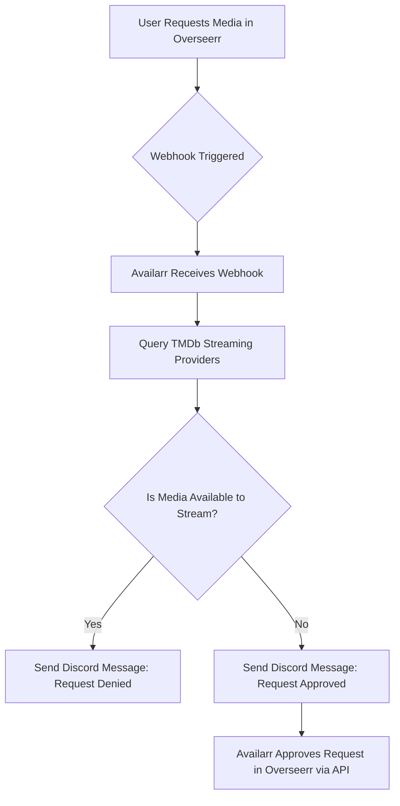

[]
 


# 🤖 Availarr: The Ultimate Streaming Request Gatekeeper

Availarr is a webhook-based automation service that checks whether requested media (movies or TV shows) are available on select streaming services **before** allowing the request in Overseerr. If it's already available to stream, the request is denied and a message is sent to Discord. If it's not available, the request is **automatically approved**.

> ⚠️ **IMPORTANT**: You MUST disable "Auto Approve" in Overseerr. If you don't, Availarr will NOT work properly.

---

## ✨ Features

* ✅ Checks media availability on TMDb (backed by Prime, Netflix, Apple TV+, Discovery+, Paramount+ etc...)
* 🚀 Webhook-based — plug directly into Overseerr
* 🚨 Sends Discord alerts on rejections or approvals
* 🌐 Live web interface for entering API keys and selecting provider settings
* 🔗 Easy Docker deployment — no need for `.env` or volumes

---

## 🚧 Deployment Instructions

### 1. 🚀 Prerequisites

> ⚠️ **Overseerr Auto-Approve MUST BE DISABLED** — this is required for Availarr to function correctly.

You'll need the following:

* ✨ **TMDb API Key**
  [Get one here](https://www.themoviedb.org/settings/api)

* ⚖️ **Overseerr API Key**
  Found in Overseerr settings under "API"

* 🧡 **Discord Webhook URL**
  From Discord > Edit Channel > Integrations > Webhooks

---

### 2. 🏢 Docker Deployment

Your up-to-date `docker-compose.yml` should look like:

```yaml
version: '3.8'

services:
  availarr:
    container_name: availarr
    image: availarr/availarr:latest

    ports:
      - "8686:8686"
    restart: unless-stopped

    environment:
      - TZ=America/Chicago

    volumes:
      - availarr_config:/config

    logging:
      driver: json-file
      options:
        max-size: "10m"
        max-file: "3"

volumes:
  availarr_config:
```

Deploy the container using the following commands:

```bash
docker-compose pull
docker-compose up -d
```

---

### 3. 🔐 Login & Web Interface

Navigate to: [http://localhost:8686](http://localhost:8686)

On your **first visit**, log in using the default credentials:

```
Username: admin
Password: admin *(temporary default — please change immediately after login)*
```

You will then be prompted to create your **own username and password** to secure the interface.

After logging in, enter the following configuration:

* ✅ Your TMDb API Key
* ✅ Your Overseerr URL and API Key
* ✅ Your Discord Webhook URL
* ✅ The streaming providers you subscribe to (e.g. Netflix, Prime Video, etc.)

> ⚠️ You must press the **Save** button after entering your settings.
> 🔁 If you forget your credentials, you can reset them by deleting the `config.json` file in the container or volume.

---

### 4. 🎭 Overseerr Webhook Setup

In Overseerr:

1. Go to **Settings > Webhooks > Add Webhook**
2. Check the box for **Enable Agent**
3. Set the Webhook URL: `http://<your-availarr-server-ip>:8686/webhook`
4. Check the following boxes:

   * ✅ Request Pending Approval
   * ✅ Request Automatically Approved
   * ✅ Request Available
5. Click **Save**

> ⚠️ Again: Be sure **Auto-Approve is DISABLED** in Overseerr!

---

## 🔄 Request Processing Flow



---

## 📊 Logging and Monitoring

* Logs output to stdout and Docker logs
* Structured logging via `logging.json`

---

## 🚩 Final Notes

> ⚠️ **If you do not disable Overseerr Auto-Approve**, this app **will not function properly**.

Availarr was built to give control back to media server admins and avoid wasting downloads on content already available to your users. Keep it lean, smart, and Discord-notified.

---

## ⚙️ Maintained By

**@emattsJ**
Docker Hub: [https://hub.docker.com/r/ematts/availarr](https://hub.docker.com/r/ematts/availarr)

---

## 📝 Changelog Summary

Frontend & UI
🚀 Replaced JavaScript-based login error handling with server-rendered  block in login.html

✅ Added password mismatch validation message in change_password.html

🌗 Implemented fully responsive dark mode toggle and styled header in index.html

🖼️ Resolved logo and static asset loading issues by ensuring correct static file paths

Backend (FastAPI)
🔐 Updated main.py to use TemplateResponse for login and index rendering

✅ Fixed session-based login flow:

Redirects on first login to /change-password

🧠 Ensured config values persist using CONFIG_PATH volume (/config)

✅ Validated and securely hashed credentials before saving

🔍 Added detailed logging for all route registration and authentication events

🧪 Verified and logged TMDb / Overseerr / Discord test route results

Webhook & Config Logic
🎯 Improved webhook handling:

Auto-approves if not found on any provider

Declines or deletes if found on allowed providers

📡 Normalized provider name matching for accuracy (e.g., Paramount+, with ads)

📥 Enhanced load_config() with robust fallback and default initialization

🛡️ Centralized get_required_config() for validating API keys and URLs

🔔 Improved Discord notifications:

Docker & Deployment
🐳 Dockerfile optimized:

Removed duplicate COPY commands

Ensured correct working directory and static files path

Declared required ports and dependencies

✅ Volume-mapped /config for persistent storage of config.json and .session_secret

Security & Session Handling
🔑 SessionMiddleware added with secure secret generation and 1-hour expiration

🧼 Session cleared after logout or password change

👮 Custom auth dependency verify_session applied to all /api routes


## 🔐 Resetting Availarr Credentials

If you need to reset your Availarr credentials, follow these steps to delete the key/config file inside the Docker container:

---

### Step 1: Open Terminal on Your Host Machine

Make sure you're on the host where the Availarr container is running. If it's a remote server, SSH into it:

```bash
ssh username@hostname
```

---

### Step 2: Identify the Container Name

Run the following command to list running containers and confirm the name is `availarr`:

```bash
docker ps
```

Look for a container with the **name** `availarr`. Example output:

```
CONTAINER ID   IMAGE                     COMMAND   ...   NAMES
abc123456789   ghcr.io/emattsj/availarr  ...            availarr
```

---

### Step 3: Access the Container Shell

Run an interactive shell inside the container:

```bash
docker exec -it availarr /bin/bash
```

If `/bin/bash` is not available, use:

```bash
docker exec -it availarr /bin/sh
```

---

### Step 4: Locate and Delete the Key File

Once inside the container, change to the config directory:

```bash
cd ..
cd config
```

List the contents to confirm:

```bash
ls
```

Look for a file like `config.json` or another file that stores credentials or keys.

**Delete the file**:

```bash
rm config.json
```

> ⚠️ **Caution:** Be sure you're deleting the correct file. You can inspect it with:

```bash
cat config.json
```

---

### Step 5: Exit the Container

Type:

```bash
exit
```

---

### Step 6: Restart the Container

To apply the changes and reset credentials:

```bash
docker restart availarr
```

---

### Step 7: Access the Web Interface

Open your browser and visit:

```
http://<host-ip>:8686
```

You will be prompted to set new credentials.

---

## ✅ Summary of Commands

```bash
docker exec -it availarr /bin/bash
cd ..
cd config
rm config.json
exit
docker restart availarr
```

---

**Note:** If you're unsure which file to delete or need help automating this process, open an issue or ask for assistance.


---

**Reminder:** Be sure to pull the latest container and test the updated login flow. If upgrading from a previous version, remove any old `config.json` if login issues occur.
